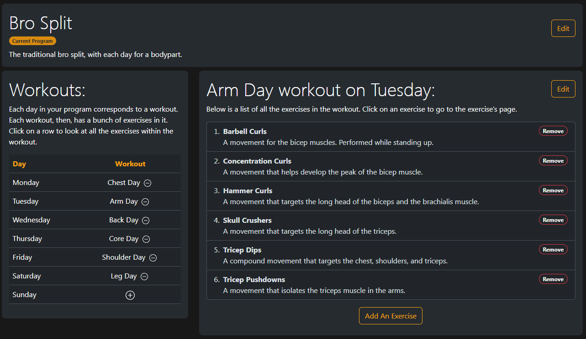
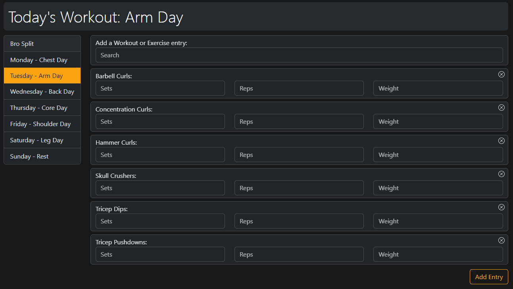

# IronLogs
Before running the app, make sure you install the requirements as listed under [requirements.txt](./requirements.txt) (if you have `python` and `pip` installed, you can run `pip install -r requirements.txt`). 

Then run,
```shell
prompt> python manage.py runserver
```

If you want to run the app in a virtual environment, then navigate into the project directory and execute `python3 -m venv .venv`. This will create a virtual environment named `.venv`. To activate the virtual environment, enter: `source .venv/bin/activate`. If it worked, you should see `(.venv)` before the command prompt.

Install the requirements as mentioned above. Verify that Django is installed by entering: `python3 -m django --version`. Then, run the command `python manage.py runserver`

This will spin up the app at your localhost (127.0.0.1). A link to the development server will also be printed in the terminal. You can Ctrl+click the link there to open the app in your browser.

## About

For my day-to-day workouts I had been using a written journal to keep track of my workouts. An entry for the day would follow the format:
```
Date: DD-MM-YYYY
Day: [Day_of_the_week]
Workout: [Workout_name]

Exercise_name: sets x reps (weight)
Exercise_name: sets x reps (weight)
Exercise_name: sets x reps (weight)
Exercise_name: sets x reps (weight)

[Some notes]
```

I would devise a program, decide how many workouts I'll have per week, decide how many exercises each workout will have, and then record the particular day's entry in my journal in the above format. This project is my attempt to turn this journaling system into a web app. With that being said,

IronLogs is a workout journaling app to log workouts, track performance, and organize exercise programs. 

## Features

### Organize Exercise Programs

The app allows the user to create a number of exercise programs. Each program can contain a number of workouts, each one set to a specific day of the week. Each of these workouts, then, can have a number of exercises within it.



### Log Workouts

Once the user has populated their weekly schedule with workouts and selected a program as their current program, they can start adding journal entries. The journal homepage presents the user with their current program's weekly schedule pre-loaded with exercise entries as specified within the day's workout. The user can enter details of their workout and submit the entry.



Additionally, a search bar is provided where the user can lookup a particular workout or an exercise and append the associated journal entry forms into today's entry.

### Track Performace

All submitted entries can be viewed from the Entries page. By default, the Entry View shows the current week's exercise entries. It also contains a calendar which marks the dates for which an entry exists. The user can click on a particular date and get the exercise entries associated with it. If no entry exists for the date, they are instead prompted to add one.

Any particular entry can edited by clicking on the edit button (which also presents an option to delete the entry itself). Furthermore, the user can search for all entries within a particular time period. For these selected time periods, the view also presents the user with a pie chart denoting bodypart workout distribution.


## Distinctiveness and Complexity
