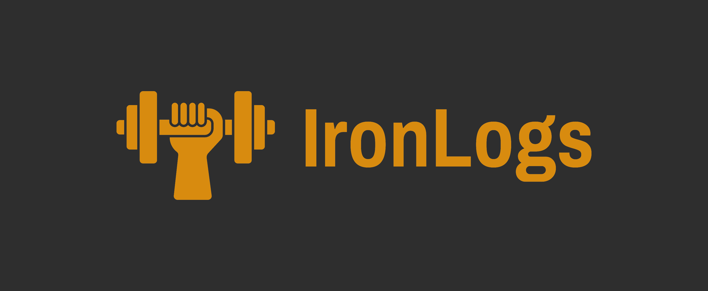

# IronLogs
Before running the app, make sure you install the requirements as listed under [requirements.txt](./requirements.txt) (if you have `python` and `pip` installed, you can run `pip install -r requirements.txt`). While a demo database is provided in this repo, if you want to start with  a fresh database instance, delete the provided `db.sqlite3` file, remove all migrations in the [migrations](./journal/migrations/) folder, and run the following commands,

```shell
prompt> python manage.py makemigrations journal
prompt> python manage.py migrate
```

to make migrations for the `journal` app and to apply the migrations to the database. The app needs some initial data for a couple of its models which is contained in the [fixtures](./journal/fixtures/) folder. To load it into the fresh db instance, run

```shell
prompt> python manage.py loaddata initial_data.json
```

To launch a development server, run
```shell
prompt> python manage.py runserver
```

This will spin up the app at your localhost (127.0.0.1). A link to the development server will also be printed in the terminal. You can Ctrl+click the link there to open the app in your browser.

If you want to run the app in a virtual environment, then navigate into the project directory and execute `python -m venv .venv`. This will create a virtual environment named `.venv`. To activate the virtual environment, enter: `source .venv/bin/activate`. If it worked, you should see `(.venv)` before the command prompt.

Do the prequesits as mentioned above. Verify that Django is installed by entering: `python -m django --version`. Then, run the command `python manage.py runserver` to run a development server.

## About

For my day-to-day workouts at the gym, I had been using a written journal to keep track of them. An entry for the day would follow the format:
```
Date: DD-MM-YYYY
Day: [Day_of_the_week]
Workout: [Workout_name]

Exercise_name: sets x reps (weight)
Exercise_name: sets x reps (weight)
Exercise_name: sets x reps (weight)
Exercise_name: sets x reps (weight)
```

I would devise a program, decide how many workouts I'll have per week, decide how many exercises each workout will have, and then record the particular day's entry in my journal in the above format. This project is my attempt to turn this journaling system into a web app. With that being said,

IronLogs is a workout journaling app to log workouts, track performance, and organize exercise programs. 

## Features

### Organize Exercise Programs

The app allows the user to create a number of exercise programs. Each program can contain a number of workouts, each one set to a specific day of the week. Each of these workouts, then, can have a number of exercises within it.


### Log Workouts

Once the user has populated their weekly schedule with workouts and selected a program as their current program, they can start adding journal entries. The journal homepage presents the user with their current program's weekly schedule pre-loaded with exercise entries as specified within the day's workout. The user can enter details of their workout and submit the entry.


Additionally, a search bar is provided where the user can lookup a particular workout or an exercise and append the associated journal entry forms into today's entry.

### Track Performace

All submitted entries can be viewed from the Entries page. By default, the Entry View shows the current week's exercise entries. It also contains a calendar which marks the dates for which an entry exists. The user can click on a particular date and get the exercise entries associated with it. If no entry exists for the date, they are instead prompted to add one.

Any particular entry can be edited by clicking on the edit button (which also presents an option to remove the entry itself). Furthermore, the user can search for all entries within a particular time period. For these selected time periods, the view also presents the user with a doughnut chart representing bodypart workout distribution. The app uses the [Chart.js](https://www.chartjs.org/) library to display its charts.


Furthermore, the user can view their progress and performance on a per-exercise basis in the Exercise View. It contains a table of all the exercises the user has ever made across all programs. This table can be filtered for a particular program, workout, or a body part. A search bar is also provided where the user can look for a specific exercise directly.


Clicking on a particular exercise presents the user with the analytics for that exercise across the last 50 journal entries. The data is presented across two charts -- one containing the user's performance on a time vs intensity line chart, the other containing the time vs volume bar chart.


### Mobile Responsive

The app supports viewing on mobile, tablets, and other smaller devices.


## Documentation

***IronLogs*** is a single-page application which consists of 4 views:

- Journal View
- Entries View
- Program View
- Exercises View

Each view is managed by a respective module (a separate JavaScript file) with three additional modules to manage basic utility functions (like generating and submitting common forms, managing constants, toggling views, etc.), the browser’s history stack and routing, and animations. I will now explain, briefly, what the responsibilities of each modules are. More extensive documentation is available in the module files themselves.

### Utils.js

Just like a usual utility module, the `utils` module provides methods which are frequently used by other modules to perform repetitive tasks like generating elements and submitting forms. Here is a list of the functions it perfomrs:

- Upon page load, initializes all the view containers to their respective variables (each view has their own initializer for this).
- Contains all the constants needed across the app (alongwith some SVGs) at the top level. 
- Initializes the listeners for history management as well as the view buttons on the navbar.
- Handles toggling between different views.
- Handles displaying any messages. The app uses *Bootstrap*'s toasts to display these messages.
- Generates text input fields, textareas, and buttons.
- Also generates all Search Bars used across the app. Handles fetching and displaying of search results and attaches callback functions to those results.
- Handles generation, validation, and submission of all exercise entry forms used in the app.

### Journal.js

The ***Journal View*** consists of two columns-- one that holds a workout card containing all the workouts for the week from the user's current program, and the second, which holds all the entry forms for each exercise in the currently selected workout. Its main purpose is to allow the user to create today's journal entry.

- By default, the card highlights the row for today's workout. If the user clicks on a row in the card, then that workout's exercise's forms are loaded on the right column.
- A search bar is provided in the right column where the user can look for a workout or an exercise in particular.
- Clicking on an exercise in the search results appends the exercise's entry form in the right column. Instead if the user clicks a workout, all the exercises from the workout will be appended to the current list.
- For mobile layouts, the workout card rows collapse to only show the currently active workout.
- Submitting an entry takes the user to the Entries View.

### Entries.js

The ***Entries View*** consists of a calendar, a range search form, a chart container, and an entries container in a two column setup. Its main purpose is to display and manage the user's journal entries. By default, the view presents the user with the current week's entries.

- The calendar marks days for which an entry exists. The user can go back and forth in the calendar's months using the navigation buttons and the data will be refreshed for that particular month.
- If the user clicks on an entry in the calendar, the particular entry is loaded in the right column. If the clicked date doesn't have an entry, the user is instead prompted to add one.
- The right column also contains a search bar, much like the one in the ***Journal View***. Its functions are also identical.
- The user can also select a date range and fetch all the entries within the range.
- Whenever entries within a range are displayed, the view also presents the user with a doughnut chart of the bodypart distribution for all the entries. The chart counts the number of exercise entries per body part.

### Program.js

The ***Program View*** displays a list of all of the user's programs while highlighting the current one. Clicking on a program in the list opens up the particulars of that program. This is the most involved view because it manages all the data models required on the backend.

- The user can create multiple programs. They can also set one of them to be the current program. The current program's workout entries will be displayed on the ***Journal View***.
- A program consists of one or more workouts, each corresponding to a day of the week. A workout can be on multiple days of the week.
- A workout consists of one or more exercises. An exercise can be a part of any program or workout.
- The view facilitates the management of all three of these entities, allowing CRUD operations on any individual one. Most of the code here deals with generation, validation, and submission of the forms associated with each model.

### Exercises.js

The ***Exercises View*** contains a list of all of the user's exercises in a table. The table contains 4 columns -- Exercise, Body Part, Workout, and Program. Clicking on an exercise in the table takes the user to the exercise's details. Clicking on any other entry in the remaining 3 columns filters the table with the clicked entry as the filter. For example, clicking on a workout in the workout column would filter the table to show all the exercises within that workout. A search bar is also provided above the table so the user can look up a specific exercise.

The exercise page includes the details of the exercise, allows editing and deleting an exercise, and displays performance analytics for the last 50 entries. The analytics are presented as a pair of graphs -- one plotting the time vs exercise intensity, while the other one plots time against exercise volume (volume is calculated based on total reps performed, i.e., sets x reps). Additionally, the last 50 entries are also displayed in a list.

### History.js

Throughout the 4 views, the app keeps track of the current state of the application by pushing a state object onto the browser's history stack. This is done whenever a user interaction makes a substantial change to the page (like submitting a form, opening a particular program or exercise, etc.). The ***History Module*** parses this state object and calls the right functions to restore state after a `popstate` event is fired. The details of each view's state object are included inside the documentation comments.


### Animation.js

The ***Animation Module***... well, it is an idea which I started but decided not to pursure further. The plan was to add a bunch of animations to all the tables, graphs, and other cards on the website whenever they would be loaded or be removed. Also, for smaller devices, some of the longer lists and cards would collapse so as to present the information more concisely.

A part of this was implemented in the workout card that's displayed in the ***Journal View***. It collapses to a single row when the window size goes below a certain breakpoint. Additionally, a button is generated on the header row which helps expand and collapse the workout card's contents. Also, whenever the entry forms are loaded, they load in with a cascading fade-in animation.

Working through that, I quickly realized that this venture would require far more work to adapt it to the dynamically generated content inside the app, especially if the animation of a component depends on whether another component is present or not (for example, the cascading fade-in animation requires a running counter to number each form that is generated in order to stagger their fade-in animation). This would lead to an extensive rewrite of the codebase and would probably require a lot more research on my part to get it working without relying on external frameworks (not to mention all the animation related bugs that can happen). So I decided to cut my losses for now and move on to the other courses I had been taking at the time.

### Backend Files

Finally, the Django backend helps orchestrate the frontend show by providing the necessary API endpoints. There's about a couple dozen of them, but aside from the more involved requests (for graphs or the calendar), most of it is made up of simple queries into the database. A bulk of the code is just try-catch blocks and input validation. The urls along with their respective view functions are segregated based on the models they deal with. The user's programs, workouts, exercises, and journal entries, each correspond to a Django model along with the body part mentioned above.

The number of body parts is currently fixed to 6 hardcoded values contained inside the [fixtures](./journal/fixtures/) folder. This is to ensure consistency across different exercises and generating proper graphs. The user is not allowed to modify these values or create further entries. The similar case applies to the Day model, which was created, purely, to deal with the discrepency between how Python starts its week on Monday as day 0, while JavaScript does it with Sunday as day 0. This model helps tie workouts to a specific day of the week such that it aligns with the functions on the frontend without having to modify values everytime a workout is processed.

As for the stylesheets, since we're using ***Bootstrap*** for our components, most of the CSS deals with modifying the Bootstrap defaults to match the app's color scheme. Aside from that, it deals with managing the margins and padding so that the layout looks nice on both desktop and mobile viewports. The CSS code contains the global modifications at the top-level with differentiated blocks corresponding to each view.